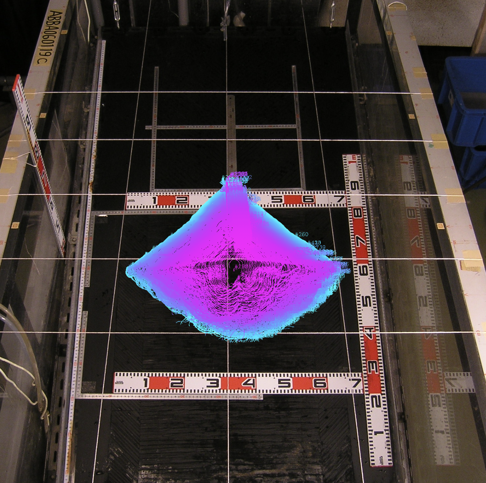

# Image Data Flume Experiment Extraction

These scripts are designed for extracting contours from images by Computer Vision (cv2) package and saving them for later use. It includes functionality for loading images, processing them to find contours, and saving those contours in a structured format.



## Project Structure

```
im_data_lab_extraction
├── src
│   ├── extract_cnts_box.py      # Main logic for extracting contours from images
│   ├── save_contours.py          # Functionality to save contours to a JSON file
│   ├── load_contours.py          # Functionality to load contours from a JSON file
│   └── utils
│       └── __init__.py           # Initialization file for utility functions
├── data
│   ├── contours.json             # JSON file to store extracted contours
│   └── README.md                  # Documentation for the data directory
├── requirements.txt               # List of project dependencies
└── README.md                      # Overall documentation for the project
```

## Installation

To set up the project, clone the repository and install the required dependencies:

```bash
pip install -r requirements.txt
```

## Usage

1. **Extracting Contours**: Use the `extract_cnts_box.py` script to load images and extract contours. You can specify the reference box for contour extraction.

2. **Saving Contours**:(not using yet) After extracting contours, use the `save_contours.py` script to save the contours to `data/contours.json`.

3. **Loading Contours**: Use the `load_contours.py` script to read the saved contours from `data/contours.json` for further processing or analy`sis.