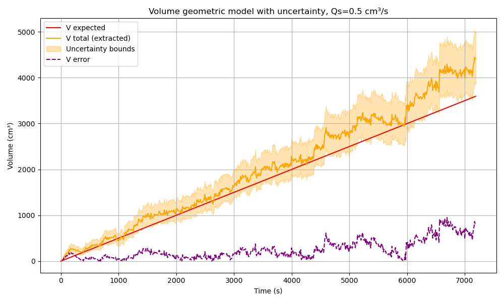
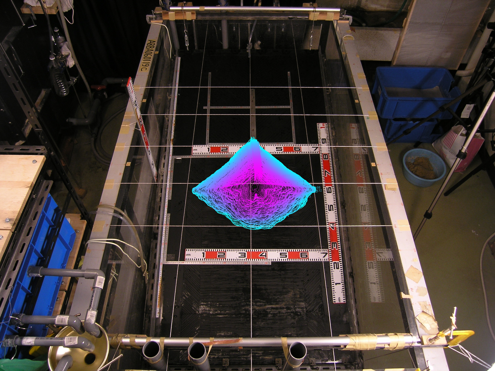
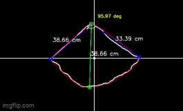
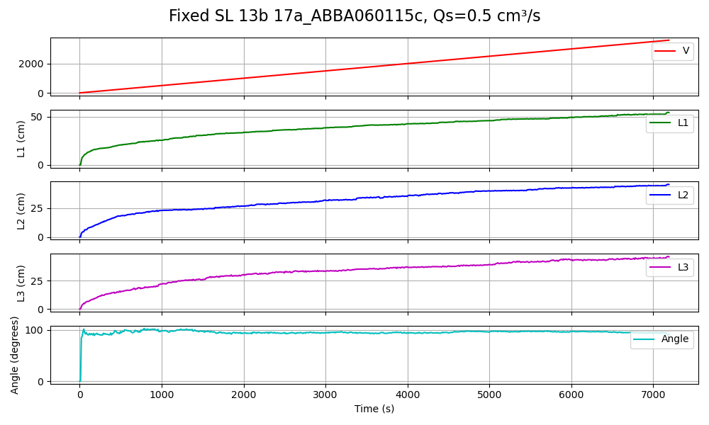
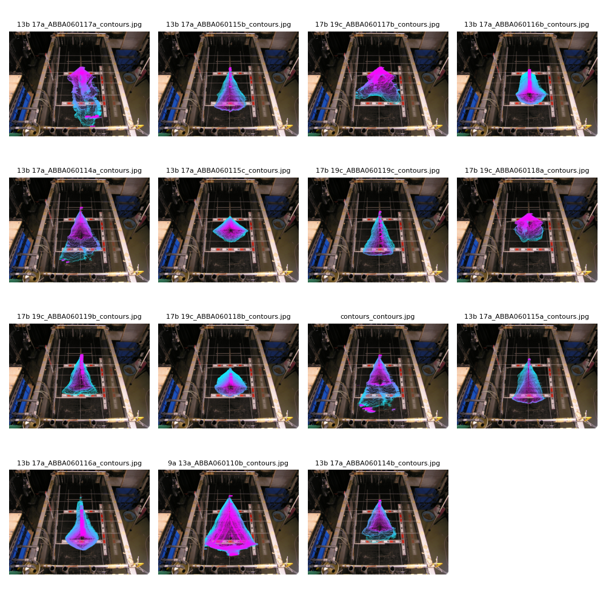

# Image Data Flume Experiment Extraction

These scripts are designed for extracting contours from images by Computer Vision (cv2) package and saving them for later use. It includes functionality for loading images, processing them to find contours, and saving those contours in a structured format.

Example of volume metric fitting model for a run. This show that the extracted parameters from the images fit quite closely with the expected volume. It make statistically senses that the extracted volume is majority under the red curve.






## Transformation Matrices

Using the calibration image of 3 rulers on the angled bed, I used the 4 points to get the perspective and using linear algebra solver to find the transformation matrix that is used to calculated the estimated lengths for L1, L2, L3, and the angle.

Check the gif for the working results of 13b 17a_ABBA060115c or SI Run 4 [Kim & Muto (2007)](https://agupubs.onlinelibrary.wiley.com/doi/full/10.1029/2006JF000561)





Check out: 

[Perspective Transform OpenCV](https://docs.opencv.org/4.x/da/d6e/tutorial_py_geometric_transformations.html#:~:text=Perspective%20Transformation&text=To%20find%20this%20transformation%20matrix%2C%20you%20need%204%20points%20on,getPerspectiveTransform.)

[OpenCV with Transformation Matrix](https://docs.opencv.org/4.x/d9/d0c/group__calib3d.html)

### All Runs
All flume experiment runs that I need from from Kim & Muto (2007) for delta evolution modeling.



## Project Structure
tbd

## Installation

To set up the project, clone the repository and install the required dependencies:

```bash
pip install -r requirements.txt
```

## Usage

1. **Extracting Contours**: Use the `extract_cnts_box.py` script to load images and extract contours. You can specify the reference box for contour extraction.

2. **Saving Contours**:(not using yet) After extracting contours, use the `save_contours.py` script to save the contours to `data/contours.json`.

3. **Loading Contours**: Use the `load_contours.py` script to read the saved contours from `data/contours.json` for further processing or analy`sis.